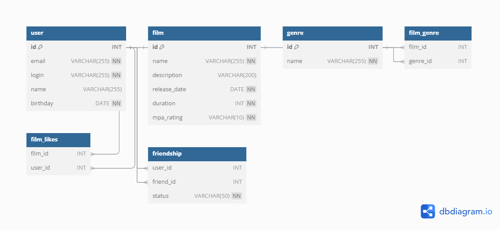

# java-filmorate
Template repository for Filmorate project.



### Получение всех пользователей
```SELECT * FROM user;```

### Этот запрос возвращает все записи из таблицы фильмов.
```SELECT * FROM film;

### Этот запрос возвращает все записи из таблицы жанров.
```SELECT * FROM genre;

### Этот запрос возвращает все жанры для указанного фильма.
```SELECT g.name 
FROM genre g
JOIN film_genre fg ON g.id = fg.genre_id
WHERE fg.film_id = 1; -- Замените 1 на ID нужного фильма

### Этот запрос возвращает все фильмы, которые понравились указанному пользователю.
```SELECT f.name 
FROM film f
JOIN film_likes fl ON f.id = fl.film_id
WHERE fl.user_id = 2; -- Замените 2 на ID нужного пользователя

### Этот запрос возвращает имена всех подтвержденных друзей указанного пользователя.
```SELECT u.name 
FROM user u
JOIN friendship f ON u.id = f.friend_id
WHERE f.user_id = 1 AND f.status = 'confirmed'; -- Замените 1 на ID нужного пользователя


